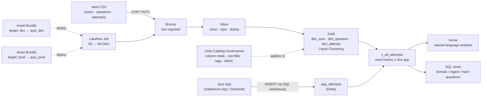

# Quiz Analytics on Databricks — DEA hands-on lab

An end-to-end **Databricks** project that exercises the full scope of the
**Databricks Certified Data Engineer Associate (DEA)** exam in one cohesive use case:
a *mock-exam analytics system*. It ingests quiz data, models it with the medallion
architecture, governs PII with Unity Catalog, ships to **dev/prod** with Asset Bundles,
orchestrates with Lakeflow Jobs, and analyzes with **Genie** — plus a **Databricks App**
where you take the quiz and the answers flow straight back into the pipeline.

> Built and validated on **Databricks Free Edition** (serverless, Unity Catalog, Genie, Apps).
> Data is synthetic; this is a personal learning / portfolio project and is **not affiliated with Databricks**.

日本語の詳細手順は [`quiz-analytics-lab/LAB_GUIDE.md`](quiz-analytics-lab/LAB_GUIDE.md)（分析基盤）と
[`quiz-analytics-lab/APP_GUIDE.md`](quiz-analytics-lab/APP_GUIDE.md)（出題アプリ）にあります。

---

## What it demonstrates

The project deliberately touches every domain of the May-2026 DEA exam outline:

| Exam domain | Where it lives | Highlights |
|---|---|---|
| **Databricks Intelligence Platform** | `src/00_setup` | Unity Catalog hierarchy (catalog → schema → volume), serverless compute |
| **Data Ingestion & Loading** | `src/01_bronze` | `COPY INTO` idempotent incremental load (`FILEFORMAT` / `FORMAT_OPTIONS` / `COPY_OPTIONS`), Auto Loader notes |
| **Transformation & Modeling** | `src/02_silver`, `src/03_gold`, `src/07_ldp_metrics` | type casting, dedup (`QUALIFY`), joins, aggregations, **Liquid Clustering**; **Lakeflow Declarative Pipeline** — streaming table + materialized view + **expectations** |
| **Lakeflow Jobs** | `resources/*.job.yml` | multi-task **DAG**, task parameters, **table-update trigger**, pipeline task, Repair run |
| **CI/CD** | `databricks.yml` | **Asset Bundle** with `dev`/`prod` targets & variables, `validate → deploy → run` |
| **Troubleshooting / Monitoring / Optimization** | `LAB_GUIDE.md` §9 | run history, Spark UI skew/spill, Predictive Optimization |
| **Governance & Security** | `src/04_governance` | column mask, row filter, governed tags, **ABAC policy** (`CREATE POLICY … has_tag()`), GRANT/REVOKE |
| **Databricks Apps** | `app/` | Streamlit quiz app writing to Delta via a SQL warehouse, App SP least-privilege GRANTs |

---

## Architecture



The loop is closed: you **take the quiz in the Databricks App**, each answer is written to
`app_attempts` in Unity Catalog, and the **analytics pipeline / Genie** then analyze your
real performance alongside the synthetic seed data.

---

## Repository structure

```
quiz-analytics-lab/
├── LAB_GUIDE.md                     # step-by-step playbook (analytics pipeline) — JP
├── APP_GUIDE.md                     # step-by-step playbook (quiz App)          — JP
├── databricks.yml                   # Asset Bundle: dev=quiz_dev / prod=quiz_prod
├── resources/
│   ├── quiz_analytics.job.yml        # Lakeflow Job (00 → 06 DAG)
│   ├── quiz_metrics.pipeline.yml     # Lakeflow Declarative Pipeline (live metrics)
│   └── quiz_metrics.job.yml          # table-update trigger → refresh metrics
├── src/
│   ├── 00_setup.py                   # catalog / schema / volume
│   ├── 01_bronze.py                  # COPY INTO ingestion (idempotent)
│   ├── 02_silver.py                  # clean / type / dedup
│   ├── 03_gold.py                    # dims / fact / aggregates (+ Liquid Clustering)
│   ├── 04_governance.py              # column mask / row filter / tags / ABAC policy
│   ├── 05_genie.py                   # analysis views + Genie question set
│   ├── 06_load_app_tables.py         # questions_app + app_attempts (+ App SP grants)
│   └── 07_ldp_metrics.py             # LDP: streaming table + materialized view + expectations
├── app/
│   ├── app.py                        # Streamlit quiz app (reads UC, writes app_attempts)
│   ├── app.yaml                      # app command & env
│   └── requirements.txt
└── seed/
    ├── users.csv                     # synthetic users (email = PII, region)
    ├── questions_full.csv            # the real 45 questions (full text) — single source for pipeline + App
    ├── attempts.csv                  # ~500 synthetic attempts across 6 users / 4 regions
    └── access_control.csv            # access-policy lookup for mask / row filter
```

---

## Data model (Gold)

- **`dim_user`** — `user_id, display_name, email (PII), region, department` (masked + row-filtered)
- **`dim_question`** — `question_id, domain, question` (real question text)
- **`fact_attempt`** — `attempt_id, user_id, question_id, domain, is_correct, mode, answered_at` — `CLUSTER BY (domain, user_id)`
- **`app_attempts`** — answers written live by the Databricks App (`…, question_id, domain, is_correct, answered_at`)
- **`v_all_attempts`** — the closed loop: seed history **∪** live App answers, the single source the analysis reads
- **`agg_domain_accuracy`** — accuracy per user × domain
- Views for Genie/BI: `v_all_attempts`, `v_domain_summary`, `v_region_summary`, `v_hard_questions`, `v_attempt_enriched`

---

## Governance model (the focus)

PII protection is demonstrated so it works even for a **single user** (no groups required):
an `access_policy` lookup table holds the current user's `pii_access` and `allowed_region`,
and mask/filter functions read it — flip your own row and re-query to see the effect.

- **Column mask** on `dim_user.email` via a SQL UDF, applied through a **schema-level ABAC policy**
  that matches any column carrying the governed tag `class.email_address`
  (`CREATE POLICY … COLUMN MASK … MATCH COLUMNS has_tag('class.email_address')`).
- **Row filter** on `dim_user.region` restricting visible rows to the user's allowed region.
- **Governed tags** for data classification and **`INFORMATION_SCHEMA`** discovery of tagged columns.
- **GRANT/REVOKE** examples following the least-privilege hierarchy (`USE CATALOG` → `USE SCHEMA` → `SELECT`).

---

## Getting started

**Prerequisites:** a Databricks workspace (Free Edition is fine) with a serverless SQL warehouse.

1. **Clone into Databricks** as a Git folder (or `git clone` locally).
2. **Analytics pipeline** — follow [`LAB_GUIDE.md`](quiz-analytics-lab/LAB_GUIDE.md):
   run `00_setup`, upload `seed/*.csv` to the `raw` volume, then run `01`→`05`.
   Or deploy the whole thing:
   ```bash
   cd quiz-analytics-lab
   databricks bundle validate
   databricks bundle deploy -t dev
   databricks bundle run quiz_analytics_job -t dev
   ```
3. **Governance experiment** — run `04_governance` cell by cell and toggle `access_policy` to watch
   masking / row-filtering change.
4. **Quiz App** — follow [`APP_GUIDE.md`](quiz-analytics-lab/APP_GUIDE.md): run `06_load_app_tables`,
   create a Databricks App from `app/`, attach a SQL warehouse, grant the App service principal,
   deploy, and take the quiz.
5. **Analyze** — open a **Genie** space over the Gold schema and ask questions in natural language.

> **Run order matters:** `03_gold` recreates `dim_user` (`CREATE OR REPLACE TABLE`), which clears
> masks/tags/filters — always run `03` before `04`.

---

## Environment notes (Free Edition)

- One workspace / one metastore; serverless only; no account console.
- Up to **3 Apps** per account; an App auto-stops 24 h after start (restartable).
- Max **5 concurrent job tasks** (this job runs its tasks sequentially, so it's unaffected).
- If `CREATE CATALOG` is not permitted, set `catalog=workspace` and use schemas `quiz_dev` / `quiz_prod`
  (the notebooks are parameterized by `catalog` + `schema`, so it's a one-line switch).

---

## Disclaimer

This is a personal study / portfolio project for the Databricks Certified Data Engineer Associate exam.
All data is synthetic. It is **not affiliated with or endorsed by Databricks**, and the bundled quiz
questions are unofficial study material.
